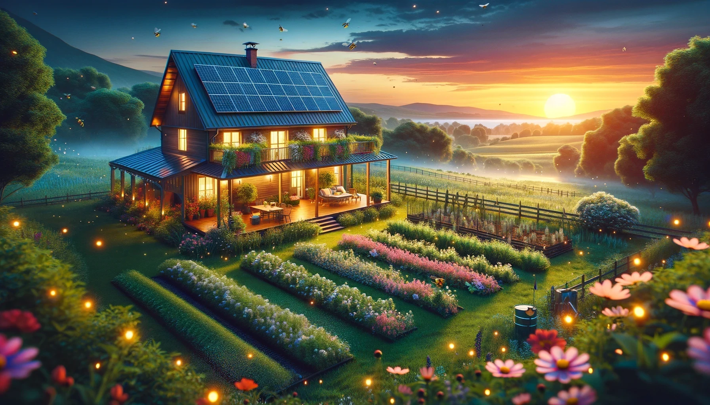
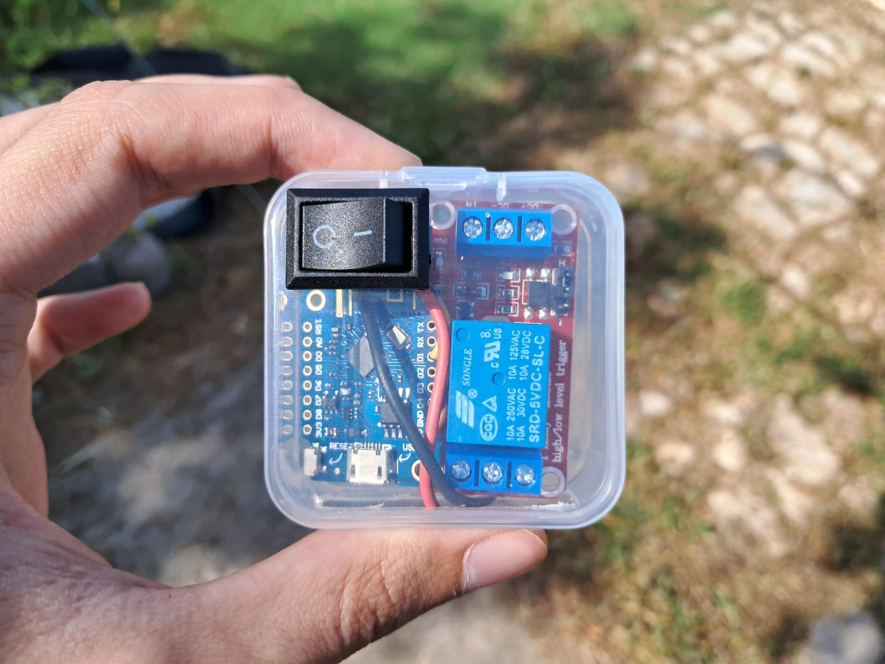
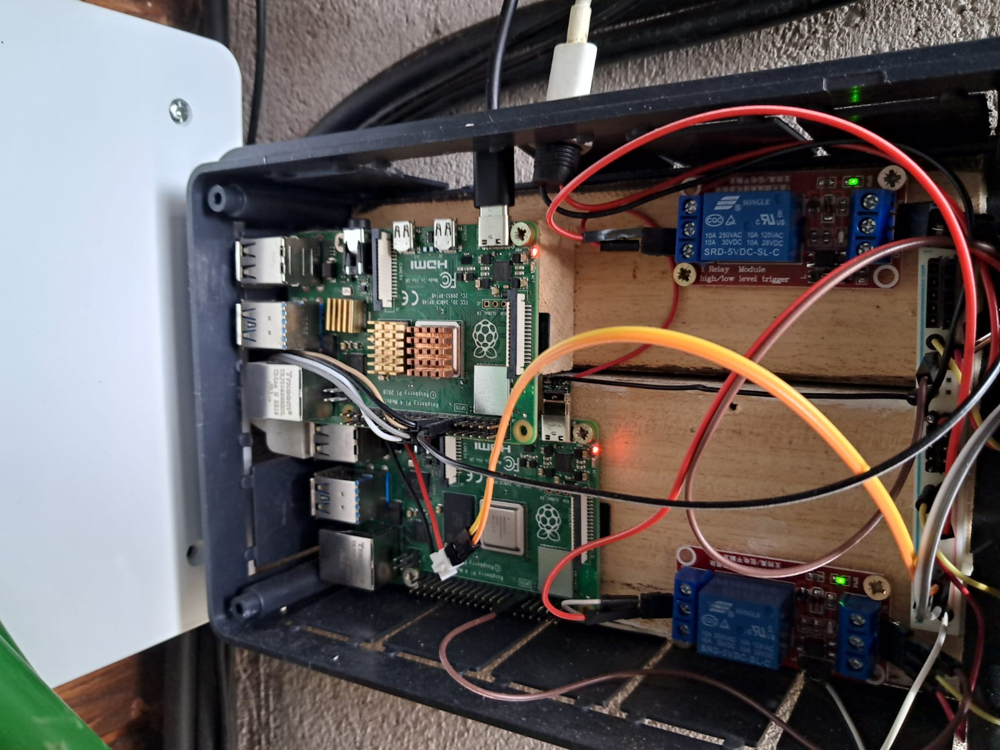

# Virtual Origen: Smart Home

## Descripción General

**Virtual Origen: Smart Home** es una aplicación diseñada para optimizar el uso de la energía en una finca tecnológicamente avanzada situada en las afueras de Cebolla, Toledo. El proyecto tiene como objetivo gestionar los recursos energéticos de la finca de manera eficiente y automática, basándose exclusivamente en la energía solar almacenada en baterías debido a la falta de suministro eléctrico convencional. La aplicación permite la gestión inteligente de dispositivos de alto consumo y sistemas de riego, adaptándose a variables como las condiciones climáticas y el estado de las baterías.

## Objetivos

- **Optimización de Recursos**: Implementar estrategias IoT para maximizar la eficiencia en la gestión de recursos, enfocándose en la autonomía energética y la automatización de procesos.
- **Desarrollo de Interfaz de Usuario**: Diseñar una interfaz de usuario intuitiva en la aplicación cliente, asegurando una experiencia amigable para el usuario final en la configuración y supervisión de dispositivos.
- **Gestión Remota**: Posibilitar la gestión remota de dispositivos inteligentes a través de la aplicación cliente, permitiendo al usuario controlar y monitorear sus sistemas desde cualquier ubicación.

## Funcionalidades Principales

- **Registro y Autorización de Usuarios**: Un sistema robusto para el registro y la autorización de usuarios, garantizando la seguridad y privacidad de la información.
- **Gestión de Propiedades**: Funcionalidades para que los usuarios puedan administrar propiedades (casas o fincas), permitiéndoles configurar y controlar múltiples ubicaciones de forma centralizada.
- **Control de Dispositivos**: Permitir la configuración y gestión de dispositivos conectados a cada propiedad, con opciones para personalizar el comportamiento de cada dispositivo según las necesidades específicas del usuario.
- **Sistema de Datos y Automatización**: Desarrollar un sistema que recolecte datos a través de MQTT y los almacene en una base de datos centralizada, permitiendo la automatización basada en datos en tiempo real.
- **Visualización Gráfica de Datos**: Integrar visualizaciones gráficas en la aplicación cliente para ofrecer a los usuarios una visión clara del estado de las baterías, el clima, el consumo energético actual y la actividad de los dispositivos en tiempo real.
- **Configuración Avanzada de Dispositivos**: Proporcionar opciones avanzadas para la configuración de dispositivos, incluyendo parámetros como el porcentaje mínimo de batería requerido, consumo máximo de energía, y ajustes basados en la probabilidad de lluvia y el horario.
- **Creación y Carga de Escenas**: Implementar funcionalidades para crear y cargar "escenas" o configuraciones predefinidas de dispositivos, que pueden ser activadas en cualquier momento según las necesidades del usuario.
- **Versión Multiplataforma**: Desarrollar la aplicación para ser accesible tanto en dispositivos Android como en formato web, asegurando una amplia compatibilidad y accesibilidad.
- **Dockerización del Servidor**: Utilizar Docker para el despliegue del sistema backend, garantizando un entorno controlado y fácilmente actualizable.

## Tecnologías Utilizadas

- **Frontend**: Flutter para el desarrollo de la aplicación cliente, asegurando interfaces intuitivas y visualmente atractivas para el usuario final.
- **Backend**: C# para el desarrollo del sistema servidor, aprovechando sus librerías para integraciones con MQTT y Firebase.
- **Base de Datos**: Firebase como solución para la base de datos NoSQL y servicios adicionales como la autenticación de usuarios y hosting.
- **MQTT**: Para la lectura y envío de datos a los dispositivos, ampliando el espectro de conocimientos tecnológicos.

## Implementación del Proyecto

- **Integración con Arduino**: Utilizando Arduino para controlar los relés que activan y desactivan los dispositivos físicos en función de mensajes MQTT.
- **Backend en C#**: Implementación de la lógica empresarial, gestión de la comunicación con la base de datos y control de la lógica de negocio de la aplicación.
- **Scripts Bash**: Automatización de tareas y gestión de sistemas basados en Unix/Linux.
- **Flutter/Dart**: Construcción de la interfaz de usuario, realización de operaciones CRUD en Firebase y aseguramiento de una interacción fluida de datos.

<table>
    <tr>
        <td></td>
        <td></td>
    </tr>
    <td colspan="2"></td>
    </tr>
</table>

## Trabajo Futuro

- Integración de notificaciones de estado para dispositivos específicos.
- Posibilidad de enlazarlo con el calendario del dispositivo o el calendario de Google.
- Mayor complejidad en las condiciones de encendido, por ejemplo, dependencia de otros dispositivos.
- Menor acoplamiento a la base de datos, aislando los clientes de la base de datos implementada por detrás.
- Integración de sistemas de seguridad como alarmas y cámaras de seguridad IP.

## Contacto

- **Autor**: Sergio de Iscar Valera
- **Tutor**: Javier Palacios González
- **Departamento**: Departamento de Informática y Comunicaciones, I.E.S. Luis Vives

## Licencia

Este proyecto está licenciado bajo la Licencia MIT.
